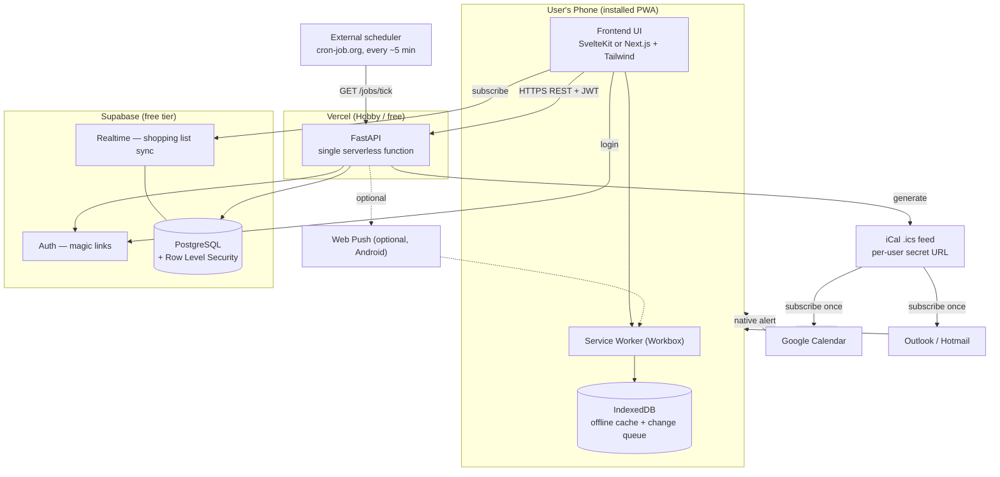
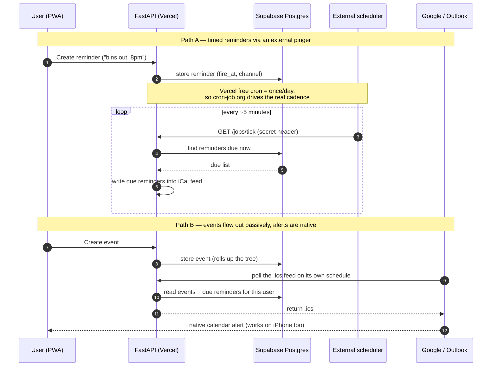

# Household Manager — Masterplan & MVP Handout

**Purpose.** Single source of truth for building Household Manager. What to build, hard constraints, build order, reasoning behind constraints.

---
# PART 1 — THE MASTERPLAN

## 1. Vision

Private, calm place to centralize household chores, tasks, reminders, events, food inventory, shopping, finances — connect outward to personal calendars (Google, Outlook/Hotmail). **Not** social network. Coordination and overview tool. Defining question: *"across all my families, what needs my attention?"*

Person can belong to several families at once; families nest across generations. App must make that legible without overwhelming.

## 2. Core principles

- **Centralize, then surface.** Info lives in one place; dashboard ranks what matters now.
- **Calm by default.** No gamification pressure, no alarm-red for routine states, no noise.
- **Accessibility is a build constraint, not a finishing step.** See section 9. Day-one decisions (component library, fixed navigation, labeled icons) are far cheaper than retrofits.
- **Lightweight and open source.** Fewer moving parts, free tiers.
- **Design around serverless, not against it.** See section 4.
- **Privacy by structure.** Operational data stays inside owning household; only calendar layer rolls up.

## 3. Tech stack

| Concern | Choice | Why |
|---|---|---|
| Backend | **Python + FastAPI** | Given. First-class, framework-detected support on Vercel. |
| Hosting | **Vercel (Hobby/free)** | FastAPI deploys as one serverless function. Python runtime 3.12+. 500 MB bundle limit. |
| Database | **Supabase Postgres (free)** | Survives stateless functions; built-in connection pooler; bundles Auth + Realtime + RLS; open source. |
| ORM / migrations | **SQLModel + Alembic** | SQLModel unifies DB models and API schemas; Alembic gives reproducible migrations. |
| Auth | **Supabase Auth, magic links** | Passwordless removes memory/anxiety tax across grandparents → kids. |
| Frontend | **PWA** — SvelteKit *or* Next.js + **Tailwind** | Webapp, lightweight, installable, offline-capable. Svelte = smallest bundle; Next = Vercel-native. |
| UI components | **Accessibility-first lib**: Melt UI / Bits UI (Svelte) or Radix / shadcn (React) | Correct focus, keyboard nav, ARIA out of the box. Do not hand-roll. |
| Realtime | **Supabase Realtime** | Live shopping-list sync without WebSocket servers (which serverless can't host well). |
| Offline | **Workbox + IndexedDB** | Service worker cache + change queue that syncs when back online. |
| Scheduling | **External pinger (cron-job.org)** hitting a protected API route | Vercel free cron is **once/day only**; external pinger drives ~5-min cadence for free. |
| Notifications | **iCal feed (primary)** + **Web Push (optional, Android)** | Calendar apps fire native alerts cross-platform; no push infra required. |
| Calendar out | **Per-user iCal `.ics` feed** | One-way subscribe = most value at a tenth the complexity. |
| Calendar two-way | Google Calendar API + Microsoft Graph (OAuth2) | **Deferred.** Only if one-way feed proves insufficient. |
| Barcode (inventory) | `html5-qrcode` + **Open Food Facts** | Browser camera scan + free product DB. Kills manual-entry friction. |

## 4. Hard constraints (the serverless realities)

Facts that shape architecture. Violating them produces mysterious bugs.

1. **Functions are stateless and ephemeral.** No on-disk SQLite, no in-memory state between requests, no long-lived DB connections, no in-process background workers. All persistence in Supabase; reach Postgres through its **connection pooler**.
2. **Free cron runs once per day**, fired sometime within chosen hour. Anything more frequent fails at deploy. Timed reminders driven by **external scheduler** hitting `GET /jobs/tick` (protected by secret header), not Vercel cron.
3. **iPhone web push is not relied upon.** Notifications go out through **calendar feed**; user's native calendar app does alerting on every platform. Web Push is Android-only bonus.
4. **Keep bundle lean.** Heavy Python deps (e.g. large ML libs) blow 500 MB limit and slow cold starts. Only add what's needed.
5. **Vercel Hobby is a hard constraint (confirmed — no Pro).** Two implications. (a) External scheduler in #2 is **mandatory** — never depend on sub-daily Vercel cron. (b) Hobby terms are **non-commercial** use, so app must not be monetized/charged-for (private extended-family use qualifies), and must stay within free resource limits — both Vercel's (function execution, bandwidth) and Supabase's free-tier quotas.

## 5. Architecture — system



**Key reading:** nothing stateful lives in Vercel — pure compute. All persistence in Supabase. Two solid lines from calendars back to phone = primary notification channel.

## 6. Architecture — data model

```mermaid
erDiagram
    PERSON ||--o{ MEMBERSHIP : "joins via"
    GROUP  ||--o{ MEMBERSHIP : "has"
    GROUP  ||--o{ GROUP : "parent of (nesting)"
    GROUP  ||--o{ TASK : owns
    GROUP  ||--o{ EVENT : owns
    GROUP  ||--o{ INVENTORY_ITEM : owns
    GROUP  ||--o{ SHOPPING_ITEM : owns
    GROUP  ||--o{ EXPENSE : owns
    GROUP  ||--o{ INVITE : issues
    PERSON ||--o{ TASK : "assigned to"
    PERSON ||--o{ REMINDER : owns
    PERSON ||--o{ EXPENSE : "paid by"

    PERSON {
        uuid id PK
        string email
        string display_name
        json ui_prefs "text size contrast motion"
    }
    GROUP {
        uuid id PK
        uuid parent_group_id FK "self-reference = nesting"
        string name
        int depth "0 to 4 = up to 5 layers"
    }
    MEMBERSHIP {
        uuid id PK
        uuid person_id FK
        uuid group_id FK
        string role "owner | member (all adults)"
    }
    INVITE {
        uuid id PK
        uuid group_id FK
        uuid created_by FK
        string token "unguessable, lives in the link"
        datetime expires_at
        int max_uses "null = unlimited"
        int uses
    }
    EVENT {
        uuid id PK
        uuid group_id FK
        string title
        datetime starts_at
        string rrule "iCal recurrence"
        string visibility "ROLLS UP the tree"
    }
    REMINDER {
        uuid id PK
        uuid person_id FK
        datetime fire_at
        string channel "ical push"
        string visibility "rolls up if shared"
    }
    TASK {
        uuid id PK
        uuid group_id FK
        uuid assignee_id FK
        string title
        string rrule "null = one-off chore"
        bool done
        string visibility "LOCAL to household"
    }
    SHOPPING_ITEM {
        uuid id PK
        uuid group_id FK
        string name
        bool checked
        string visibility "LOCAL to household"
    }
    INVENTORY_ITEM {
        uuid id PK
        uuid group_id FK
        string name
        string location "fridge freezer pantry"
        date expiry
        string visibility "LOCAL to household"
    }
    EXPENSE {
        uuid id PK
        uuid group_id FK
        uuid payer_id FK
        decimal amount
        string visibility "LOCAL summary only"
    }
```



### The family hierarchy (most novel part — get right first)

- **Person** = one human, one account, exists independently of any group.
- **Group** = node with optional `parent_group_id` pointing at parent group. This single self-reference is the *entire* nesting mechanism. "Grandma → mother → me" = three levels of this FK; "up to 5 layers (default 3)" = just `depth` 0–4. Nothing hard-codes generations.
- **Membership** links Person to Group with `role`. Separate many-to-many table → one person can belong to several **unrelated** groups (divorced parents, in-laws) and inherit membership **transitively** up own tree.
- Overall shape: **forest of trees with people attached at any node**, not a single hierarchy.
- Query tree with **recursive CTE** (`WITH RECURSIVE`). At this scale (dozens of groups, low hundreds of people, ≤5 deep) more than fast enough. **Do not** use closure tables or nested sets — buy performance you won't need at cost of real complexity.

### Visibility / rollup rules (decided)

- **Events** and **shared reminders** → roll **up** tree. Super-family = *shared calendar layer*.
- **Tasks/chores, shopping items, inventory, expenses** → stay **LOCAL** to owning household. Never roll up.
- Enforce with **Postgres Row Level Security**: viewer sees record if local to a group they belong to, OR rollup-type record owned by any group in their reachable subtree.

### Roles & joining (decided)

- **Everyone is an adult.** Two roles only: `owner` (created group; manages membership and invites) and `member` (everything operational). No teen/child/viewer logic — RLS simpler for it.
- **Join is link-only.** Anyone can create group, becomes `owner`. Members join via **invite link** shared over WhatsApp/email; link carries unguessable `INVITE.token`. Flow: owner generates link → recipient opens it → authenticates via magic link → `MEMBERSHIP` row created. Tokens may expire and/or cap uses. **No** friend request, directory, or social graph — links are the only join path.

## 7. Notifications & scheduling



**Point:** both paths converge on one `.ics` feed. App never delivers notifications itself — writes to feed and lets Google/Outlook do reliable, cross-platform alerting. ~5-minute granularity is fine for household life.

## 8. Recurrence

Store recurring chores and events using iCal **RRULE** standard (not custom format). Python libs: `python-dateutil` / `recurring-ical-events`. Interoperates directly with calendar feed already being built. Chore = Task with non-null `rrule`.

## 9. Accessibility requirements (autistic-friendly) — treat as acceptance criteria

Testable build constraints, not aspirations.

- **Predictable & consistent.** Fixed bottom-tab navigation; screens never reshuffle; same action always yields same visible result.
- **Explicit state.** Persistent, literal feedback ("Saved", not vanishing toast). Binary done/not-done; no fuzzy in-between states.
- **Low sensory load.** Calm, low-saturation palette. **Red reserved strictly for genuine errors** — never for routine "overdue". Respect `prefers-reduced-motion`. No autoplay, flashing, or unprompted movement.
- **One primary action per screen.** Use progressive disclosure; advanced options opened deliberately.
- **Literal language; every icon has a text label.** No idioms; no icon-only controls.
- **User control.** Adjustable text size, high-contrast mode, optional dyslexia-friendly font, density setting, **calm/batched notifications** (e.g. morning summary) rather than stream.
- **Passwordless login** (magic links) removes recurring friction.

Implementation hook: pick accessibility-first component library day one; store user prefs in `PERSON.ui_prefs`.

---

# PART 2 — THE MVP

## 10. MVP scope (the v1 contract)

**In scope (build these, nothing more, for v1):**
- Magic-link auth.
- Person / Group / Membership / Invite (link-based join) + recursive group-tree query + RLS.
- Chores & tasks (recurrence via RRULE, assignment, binary done state).
- Shared shopping list with realtime sync.
- Household events + per-user iCal `.ics` feed (events + due reminders), incl. event rollup to super-family.
- External scheduler hitting `/jobs/tick`.
- Simple overview dashboard ("what needs attention").
- Baseline accessibility (section 9) applied throughout.

**Out of MVP (do not build until v1 ships):**
- Food inventory + barcode scanning.
- Finances / expense splitting / budgets.
- Web Push.
- Two-way OAuth calendar sync.
- Meal planning, points/gamification, any social features.

**Why this cut:** chores + shopping are daily drivers that prove adoption; calendar feed makes this more than a to-do app and delivers notifications for free. Everything else is additive.

## 11. Suggested repo structure

```
household-app/
├── MASTERPLAN.md            # this file
├── api/                     # FastAPI app (deploys as one Vercel function)
│   ├── main.py              # FastAPI `app` instance (Vercel entrypoint)
│   ├── models.py            # SQLModel models
│   ├── db.py                # Supabase/Postgres session via pooler
│   ├── auth.py              # JWT verification (Supabase)
│   ├── routers/             # tasks.py, shopping.py, events.py, groups.py, jobs.py, ical.py
│   └── migrations/          # Alembic
├── web/                     # PWA frontend (SvelteKit or Next.js)
│   ├── src/
│   ├── service-worker / workbox config
│   └── manifest.webmanifest # installable PWA
├── vercel.json              # routes + (single daily) cron if used
└── requirements.txt / pyproject.toml
```

One repo, two folders — Vercel deploys both from single project.

## 12. Build phases (vertical slices)

**Phase 0 — Foundation + riskiest piece first.**
Supabase project; Person/Group/Membership/Invite tables; magic-link auth; group creation (creator becomes owner) + invite-link join. Then immediately build and test **recursive group-tree query** and **RLS scoping**. Prove nesting model while system is tiny. *This is where design is most likely wrong — find out now.*

**Phase 1 — Daily drivers.**
Chores/tasks (one entity; chore = task + RRULE) with assignment and binary done. Then shared shopping list with Supabase Realtime (check off "milk" → greys out for everyone).

**Phase 2 — Calendar slice (completes MVP).**
Household events; generate per-user secret `.ics` feed including events + due reminders; roll events/shared reminders up tree (super-family's whole job). Wire external scheduler to `/jobs/tick`. Add overview dashboard. **Ship.**

**Later (post-MVP), in value order:** inventory + barcode → finances → polish (Web Push, two-way OAuth sync, meal planning).

## 13. Suggested Claude Code task sequence

Give Claude Code one at a time. Each is a vertical slice.

1. *"Scaffold the repo per section 11. Set up FastAPI on Vercel (entrypoint `api/main.py`), SQLModel + Alembic, and a Supabase Postgres connection through the pooler. Add a health-check route. Confirm it deploys."*
2. *"Implement Person, Group, Membership, and Invite models + Alembic migration. Add magic-link auth via Supabase and JWT verification in `auth.py`. Implement group creation (creator becomes `owner`) and invite-link generation + acceptance (open link → magic-link auth → token validated → Membership created)."*
3. *"Implement the recursive group-tree query (`WITH RECURSIVE`) and RLS policies enforcing the visibility rules in section 6. Write tests proving a person sees their household's local data and rolled-up events from their subtree, but not siblings' local data."*
4. *"Build Tasks/chores end to end: model (with RRULE), API CRUD + assignment + done toggle, and a screen using the accessibility-first component lib with fixed nav and labeled icons."*
5. *"Build the shared shopping list with Supabase Realtime; checking an item updates all subscribers live."*
6. *"Build household events + the per-user iCal `.ics` feed (events + due reminders), with event rollup up the tree."*
7. *"Build `GET /jobs/tick` (secret-header protected) that moves due reminders into the feed; document the cron-job.org setup."*
8. *"Build the overview dashboard: across all the user's groups, show overdue/today tasks, outstanding shopping, and upcoming events, ranked by urgency, respecting visibility."*

## 14. Definition of done for the MVP

- User logs in via magic link and sees only what RLS permits.
- User creates group (becomes `owner`) and another person joins via shared invite link.
- Person in two unrelated families sees both, correctly scoped.
- Grandma at top sees rolled-up events from whole subtree but not grandchildren's chores/shopping.
- Creating recurring chore, assigning it, marking done works on phone.
- Two phones see shopping list update live.
- Created event appears in subscribed Google/Outlook calendar; timed reminder produces native alert.
- App installs as PWA and core list screens work offline.
- Accessibility checklist (section 9) passes on every shipped screen.

## 15. Decisions & remaining open questions

**Decided (locked for the build):**
- **Roles:** everyone is adult. Two roles only — `owner` (created group; manages membership/invites) and `member` (everything else).
- **Group creation & invites:** anyone can create group (becomes `owner`); members join via **invite link** shared over WhatsApp/email carrying unguessable token (see section 6). No friend requests, directory, or social graph.
- **Timezones:** everyone in one country. Store all timestamps in **UTC**; render in single app-configured local timezone. Compute reminder's `fire_at` from user's local wall-clock time using country's **IANA timezone** (via `zoneinfo`) so **DST handled automatically** — do **not** hard-code fixed UTC offset, which breaks twice a year. External scheduler also runs in UTC.
- **Hosting:** **Vercel Hobby is a hard constraint** (no Pro). External scheduler (section 4 #2) therefore mandatory; app stays non-commercial and within free limits (section 4 #5).

**Still open:**
- **iCal feed security:** per-user unguessable feed URL with rotate-on-demand. Calendar subscriptions cannot send auth headers, so secret must live in URL itself; provide "reset feed URL" action in case link leaks.

---

*End of handout. Keep this file in sync with reality as build progresses.*